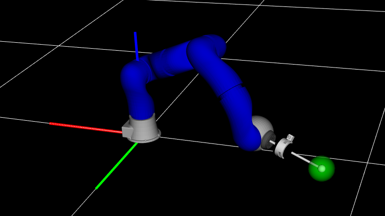

<p align="center">
  
</p>

# OpTaS

OpTaS is an OPtimization-based TAsk Specification library for task and motion planning (TAMP), trajectory optimization, and model predictive control.

The library used to support ROS, this functionality has now been moved to the dedicated [optas_ros](https://github.com/cmower/optas_ros) repository.

# Example

<p align="center">
  
</p>


In this example we implement an optimization-based IK problem.
The problem computes an optimal joint configuration $q^*\in\mathbb{R}^n$ given by

$$
q^* = \underset{q}{\text{arg}\min}~\|\|q - q_N\|\|^2\quad\text{subject to}\quad p(q) = p_g, q^-\leq q \leq q^+
$$

where
* $q\in\mathbb{R}^n$ is the joint configuration for an $n$-dof robot (in our example, we use the KUKA LWR in the above figure with $n=7$),
* $q_N\in\mathbb{R}^n$ is a nominal joint configuration,
* $\|\|\cdot\|\|$ is the Euclidean norm,
* $p: \mathbb{R}^n\rightarrow\mathbb{R}^3$ computes the end-effector position via the forward kinematics,
* $p_g\in\mathbb{R}^3$ is a goal position, and
* $q^-, q^+\in\mathbb{R}^n$ is the lower and upper joint position limits respectively.

The example problem has a quadratic cost function with nonlinear constraints.
We use the nominal configuration $q_N$ as the initial seed for the problem.

The following example script showcases some of the main features of OpTaS:
creating a robot model,
building an optimization problem,
passing the problem to a solver,
computing an optimal solution, and
visualizing the robot in a given configuration.

```python
import os
import pathlib

import optas

# Specify URDF filename
cwd = pathlib.Path(__file__).parent.resolve()  # path to current working directory
urdf_filename = os.path.join(
    cwd, "robots", "kuka_lwr", "kuka_lwr.urdf"
)  # KUKA LWR, 7-DoF

# Setup robot model
robot = optas.RobotModel(urdf_filename=urdf_filename)
name = robot.get_name()

# Setup optimization builder
T = 1
builder = optas.OptimizationBuilder(T, robots=robot)

# Setup parameters
qn = builder.add_parameter("q_nominal", robot.ndof)
pg = builder.add_parameter("p_goal", 3)

# Constraint: end goal
q = builder.get_model_state(name, 0)
end_effector_name = "end_effector_ball"
p = robot.get_global_link_position(end_effector_name, q)
builder.add_equality_constraint("end_goal", p, pg)

# Cost: nominal configuration
builder.add_cost_term("nominal", optas.sumsqr(q - qn))

# Constraint: joint position limits
builder.enforce_model_limits(name)  # joint limits extracted from URDF

# Build optimization problem
optimization = builder.build()

# Interface optimization problem with a solver
solver = optas.CasADiSolver(optimization).setup("ipopt")
# solver = optas.ScipyMinimizeSolver(optimization).setup("SLSQP")

# Specify a nominal configuration
q_nominal = optas.deg2rad([0, 45, 0, -90, 0, -45, 0])

# Get end-effector position in nominal configuration
p_nominal = robot.get_global_link_position(end_effector_name, q_nominal)

# Specify a goal end-effector position
p_goal = p_nominal + optas.DM([0.0, 0.3, -0.2])

# Reset solver parameters
solver.reset_parameters({"q_nominal": q_nominal, "p_goal": p_goal})

# Reset initial seed
solver.reset_initial_seed({f"{name}/q": q_nominal})

# Compute a solution
solution = solver.solve()
q_solution = solution[f"{name}/q"]

# Visualize the robot
params = {"link_axis_scale": 0.5}
# vis = optas.RobotVisualizer(robot, q=q_nominal, params={})  # nominal
vis = optas.RobotVisualizer(robot, q=q_solution, params=params)  # solution

# Draw goal position and start visualizer
vis.draw_sphere(0.05, rgba=[0, 1, 0, 0.5], position=p_goal.toarray().flatten().tolist())
vis.start()
```

Run the example script [example.py](example/example.py).
Other examples, including dual-arm planning, Model Predictive Control, Trajectory Optimization, etc can be found in the [example/](example) directory.

# Install

## Via pip
1. `$ python -m pip install 'optas @ git+https://github.com/cmower/optas.git'`

## From source
1. `$ git clone git@github.com:cmower/optas.git`
2. `$ cd optas`
3. `$ pip install --upgrade pip`, ensure `pip` is up-to-date
4. `$ pip install .`

## Build documentation

1. `$ cd /path/to/optas/doc`
2. `$ sudo apt install doxygen`
3. `$ doxygen`
4. Open the documentation in either HTML or PDF:
   - `html/index.html`
   - `latex/refman.pdf`

## Run tests

1. `$ cd /path/to/optas`
2. `$ pytest`

# Known Issues

- Loading robot models from xacro files is supported, however there can be issues if you are running this in a ROS agnositic environment. If you do not have ROS installed, then the xacro file should not contain ROS-specific features. For further details see [here](https://github.com/cmower/optas/issues/78).

# Citation

If you use OpTaS in your work, please consider including the following citation.

```bibtex
@inproceedings{Mower2023,
  author={Mower, Christopher E. and Moura, João and Zamani Behabadi, Nazanin and Vijayakumar, Sethu and Vercauteren, Tom and Bergeles, Christos},
  booktitle={2023 International Conference on Robotics and Automation (ICRA)},
  title={OpTaS: An Optimization-based Task Specification Library for Trajectory Optimization and Model Predictive Control},
  year={2023},
  url = {https://github.com/cmower/optas},
}
```

The preprint can be found on [arXiv](https://arxiv.org/abs/2301.13512).

# Acknowledgement

This research received funding from the European Union’s Horizon 2020 research and innovation program under grant agreement No. 101016985 ([FAROS](https://h2020faros.eu/)).
Further, this work was supported by core funding from the Wellcome/EPSRC [WT203148/Z/16/Z; NS/A000049/1].
T. Vercauteren is supported by a Medtronic / RAEng Research Chair [RCSRF1819\7\34], and C. Bergeles by an ERC Starting Grant [714562].
This work has received funding from the European Union’s Horizon 2020 research and innovation programme under grant agreement No 101017008, Enhancing Healthcare with Assistive Robotic Mobile Manipulation ([HARMONY](https://harmony-eu.org/)).

<p align="center">
  
</p>
