# Examples

To run the examples out of the box, you must have the [ROS-Pybullet Interface](https://github.com/cmower/ros_pybullet_interface) installed.
Start the simulator using
```
  $ roslaunch rpbi_examples run_kuka.launch
```

In another terminal, you can now run the examples.

## `example_kuka_lwr.py`

```
  $ python example_kuka_lwr.py SIDE INTERFACE SLSQP N
```
- `SIDE`, `1` (left) or `-1` (right)
- `INTERFACE`, `casadi` or `scipy`
- `METHOD`
  - when `INTERFACE=casadi`, `ipopt`, `snopt`, `knitro` or any other plugin solver name
  - when `INTERFACE=scipy`, `method` as in [`scipy.optimize.minimize` documentation](https://docs.scipy.org/doc/scipy/reference/generated/scipy.optimize.minimize.html)
- `N`, discretization, positive (non-zero) integer


## Comparisons

All the following plots were generated by running [`expr_pyinvk.py`](https://github.com/cmower/pyinvk/blob/master/example/expr_pyinvk.py).
PC specs experiments were run on:
- OS: Ubuntu 20.04
- 16 core Intel Core i9-9900KF CPU @ 3.60GHz,
- NVIDIA Corporation TU104 [GeForce RTX 2080 SUPER],

### Best comparisons

The following show the best performing solvers.

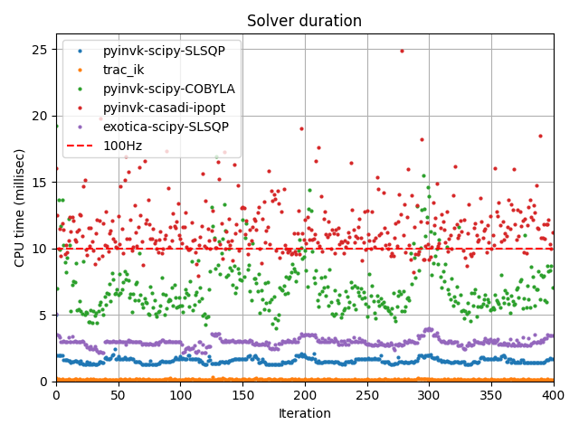

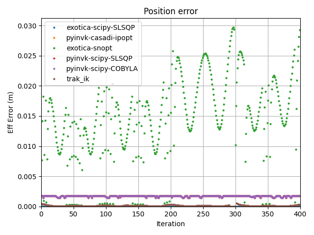

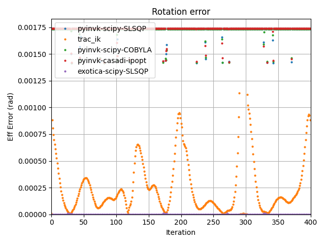

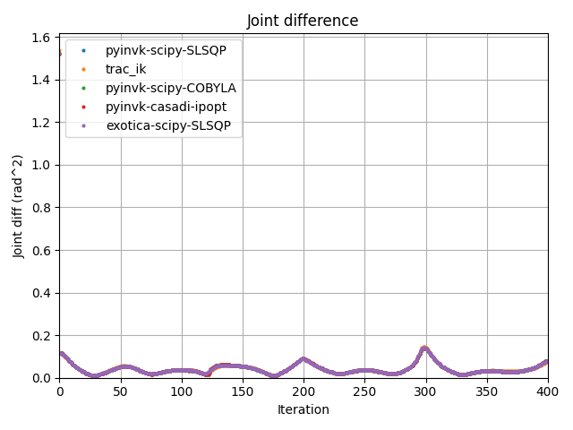

### Some comparisons

The following show some of the solvers compared.

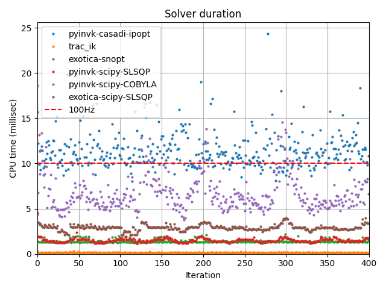

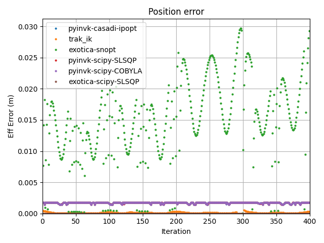

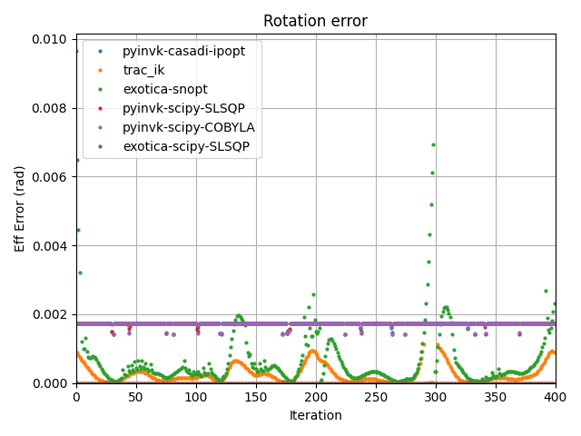

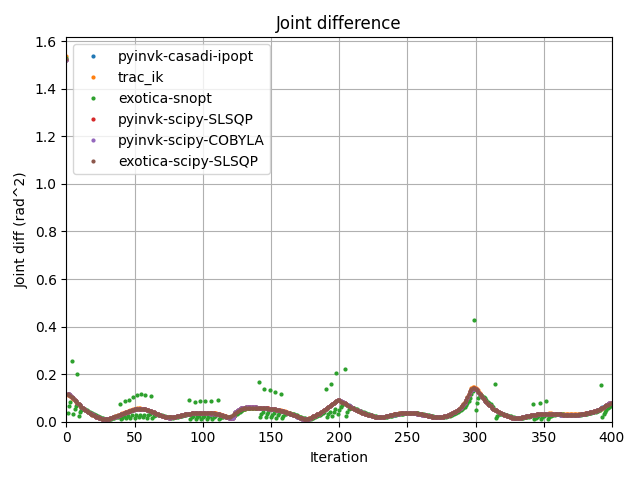

### All comparisons

The following show all the solvers that were compared.

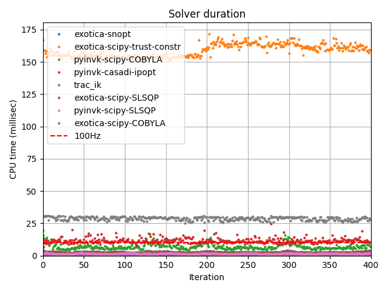

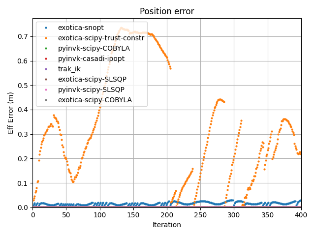

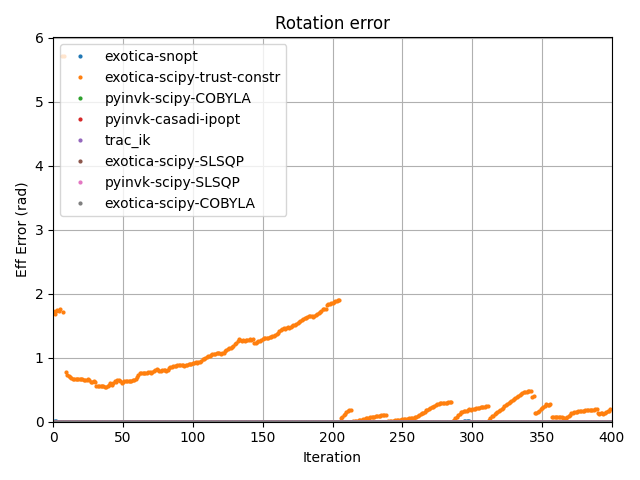

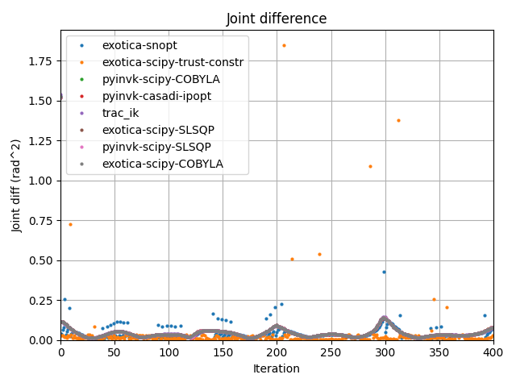
